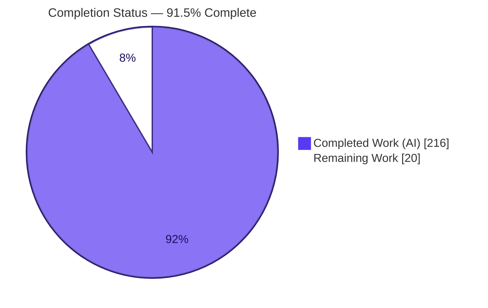
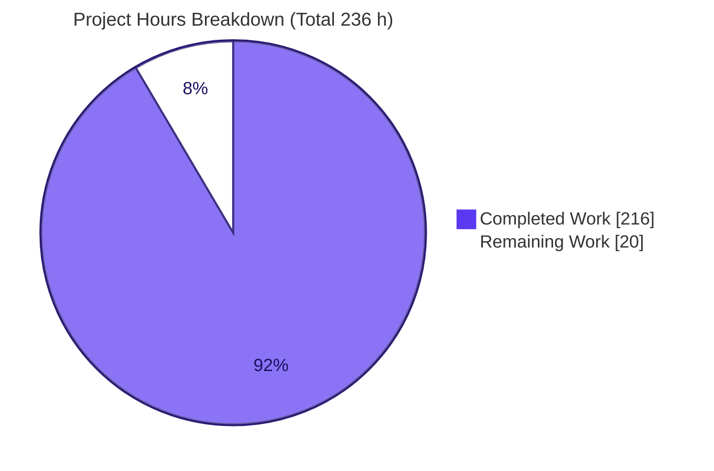
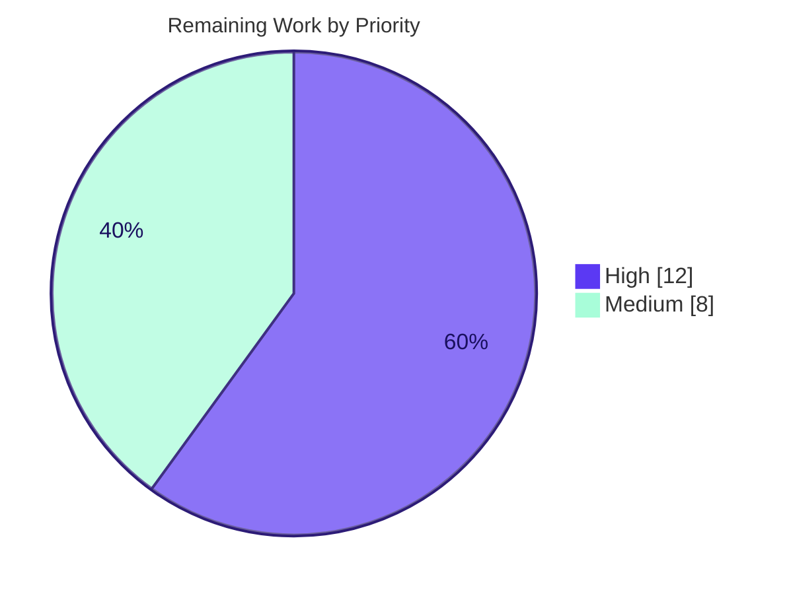

# Blitzy Project Guide — Deterministic Document Compare / Redline Engine ("Mike")

> Feature branch: `blitzy-3265d725-422e-4e6e-9d87-5099d6d4e882` · HEAD `2f76cf5` · Base `457d4a1`
> Brand palette — Completed/AI work: **Dark Blue `#5B39F3`** · Remaining: **White `#FFFFFF`** · Headings/Accents: **Violet-Black `#B23AF2`** · Highlight: **Mint `#A8FDD9`**

---

## 1. Executive Summary

### 1.1 Project Overview

This project adds a **Deterministic Document Compare / Redline Engine** — an in-house equivalent of Litera Compare — to the "Mike" legal-tech monorepo (Express/TypeScript backend + Next.js frontend). Given a base `.docx` and a revised `.docx`, it deterministically computes their differences and produces two artifacts: a downloadable Microsoft Word redline carrying **native tracked changes** (`<w:ins>` / `<w:del>` with `w:author` / `w:date`) that opens cleanly in Word and Google Docs, and a **structured diff JSON** powering in-app inline and side-by-side views. Target users are legal/contract reviewers. The engine is fully isolated, reuses existing Supabase/R2/auth infrastructure, adds exactly one dependency, and introduces no AI in the diff path (identical inputs yield byte-identical output).

### 1.2 Completion Status



| Metric | Value |
|--------|-------|
| **Total Hours** | **236 h** |
| **Completed Hours (AI + Manual)** | **216 h** (216 h AI · 0 h Manual) |
| **Remaining Hours** | **20 h** |
| **Percent Complete** | **91.5 %** |

> Completion is computed on AAP-scoped + path-to-production work only: `216 / (216 + 20) = 91.5 %`. All 216 completed hours were delivered autonomously (18 commits by `agent@blitzy.com`, zero human commits, zero fixes required at validation). The remaining 20 h is genuine human path-to-production work (secrets, live migration, deployment, and end-to-end QA against live infrastructure) that cannot be performed autonomously.

### 1.3 Key Accomplishments

- ✅ **Complete isolated compare engine** — 9 modules (2,670 LOC): docx parsing, accept-all normalization, deterministic LCS/Myers paragraph alignment, `fast-diff` word diff, native OOXML tracked-changes emission, diff-JSON builder, reparse + LibreOffice render validation, and R2 storage-key helpers.
- ✅ **Comparisons API + persistence** — Express router with three endpoints (create, status/poll, self-contained streaming download), zod validation, `checkProjectAccess`/`ensureDocAccess` enforcement, and a service-role persistence layer.
- ✅ **Exactly one dated, idempotent migration** (`20260616_01_document_comparisons.sql`) + matching `schema.sql` block — 13 columns, cascade/set-null FKs, status CHECK, two indexes, grant revocation, RLS enabled; **no existing table altered** (pure addition).
- ✅ **Frontend Compare tab** — route page + `CompareView`, `RedlineDocxView` (inline `docx-preview`), and `SideBySideDiff` (two-column with change navigation), plus minimal commented plumbing edits.
- ✅ **158 automated tests across 11 files — 100 % passing** (independently re-verified this session); byte-identical determinism proven; real LibreOffice render check; cross-project authorization rejection.
- ✅ **Clean builds** — backend `tsc` (strict) 0 errors; frontend `next build` success with the `/projects/[id]/compare` route present.
- ✅ **All three rule-mandated deliverables** — Explainability decision log (D1–D11 + 100 % traceability matrix), README onboarding section, and a 16-slide reveal.js executive deck with pinned CDNs.
- ✅ **Constraints honored** — strict isolation (no engine leakage), minimal commented edits, exactly one new dependency (`vitest ^4.1.9`), no new secrets, TypeScript/Node only.

### 1.4 Critical Unresolved Issues

There are **zero unresolved code-level defects**: the code compiles, all 158 tests pass, the engine and server run, and the Final Validator applied zero fixes. The items below are **release prerequisites** (not defects) that must be completed by humans because they require live infrastructure and credentials unavailable to the autonomous agent.

| Issue | Impact | Owner | ETA |
|-------|--------|-------|-----|
| Deployment secrets not provisioned (`SUPABASE_*`, `R2_*`, `DOWNLOAD_SIGNING_SECRET`) | Blocks request-time DB/storage; feature cannot run in a live env until set | DevOps | 2 h |
| Migration `20260616_01` not yet applied to live DB | Compare requests fail until `document_comparisons` exists | DevOps / DBA | 2 h |
| End-to-end QA against live infra not performed autonomously | Live Word/Google-Docs open + both entry flows unconfirmed on real data | QA / Eng | 8 h |

### 1.5 Access Issues

The autonomous environment intentionally holds **no production credentials** (consistent with the AAP "no new secrets" rule). This did not block build/test/runtime validation but does defer live-infrastructure verification to humans.

| System / Resource | Type of Access | Issue Description | Resolution Status | Owner |
|-------------------|----------------|-------------------|-------------------|-------|
| Supabase (live project) | Service-role key (`SUPABASE_SECRET_KEY`) | Not provisioned in autonomous env (by design) — request-time DB paths exercised only via unit tests/mocks | Pending — human sets `backend/.env` | DevOps |
| Cloudflare R2 / S3 bucket | `R2_*` credentials | Not provisioned — object read/write exercised via existing reused helpers, not live bucket | Pending — human sets `backend/.env` | DevOps |
| Download signing | `DOWNLOAD_SIGNING_SECRET` | Reused existing secret; not provisioned in autonomous env | Pending — human sets `backend/.env` | DevOps |

### 1.6 Recommended Next Steps

1. **[High]** Provision `backend/.env` secrets (`SUPABASE_URL`, `SUPABASE_SECRET_KEY`, `R2_ENDPOINT_URL`, `R2_ACCESS_KEY_ID`, `R2_SECRET_ACCESS_KEY`, `R2_BUCKET_NAME`, `DOWNLOAD_SIGNING_SECRET`).
2. **[High]** Apply and verify migration `20260616_01_document_comparisons.sql` on the live Supabase/Postgres database.
3. **[High]** Run end-to-end manual QA of both entry flows and confirm the downloaded redline opens cleanly in **MS Word and Google Docs**.
4. **[Medium]** Provision LibreOffice (`soffice`) in the backend runtime environment for the output-validation render path.
5. **[Medium]** Deploy to staging and run a compare smoke test; then promote to production.

---

## 2. Project Hours Breakdown

### 2.1 Completed Work Detail

All work below was delivered autonomously and verified (compiles, tests pass, runs).

| Component | Hours | Description |
|-----------|-------|-------------|
| Docx parsing, accept-all normalization & paragraph alignment | 30 | `parseDocx.ts` (OOXML → ordered paragraphs/runs preserving `<w:rPr>`), `normalize.ts` (accept-all on tracked inputs), `alignParagraphs.ts` (deterministic LCS/Myers with fixed tie-break) |
| Word-level diff & structured diff JSON | 13 | `wordDiff.ts` (`fast-diff` within matched paragraphs) and `diffJson.ts` (ordered hunks `{type,text,baseRange,revisedRange}`) |
| Native tracked-changes emission & valid `.docx` rezip | 20 | `emitTrackedChanges.ts` (737 LOC) — `<w:ins>`/`<w:del>` with `<w:delText>`, deleted-paragraph-mark, monotonic unique `w:id`, carried `<w:rPr>`, valid rezip |
| Engine orchestration, output validation & storage keys | 15 | `index.ts` (`runComparison` → `{redlineBytes, diff}`), `validate.ts` (reparse + optional `docxToPdf`), `storageKeys.ts` |
| Comparisons API router & persistence layer | 18 | `routes/comparisons.ts` (3 endpoints, zod, access checks, sync run, self-contained stream download) + `lib/documentComparisons.ts` (service-role insert/select/update) |
| Database migration & schema parity | 5 | Dated idempotent migration + matching `schema.sql` block (13 cols, FKs, CHECK, indexes, grants, RLS) |
| Backend server wiring — router mount, rate limiters & dependency | 3 | `index.ts` edit (mount router, `compareLimiter`, `downloadLimiter`) + `package.json` dependency/script |
| Frontend Compare views | 29 | `CompareView` (pickers/run/status/result), `RedlineDocxView` (inline `docx-preview`), `SideBySideDiff` (two-column + change nav), route `page.tsx` |
| Frontend workspace, API client & type plumbing | 6 | `ProjectPageParts` union, `ProjectWorkspace` tab/segment helpers, `mikeApi` client fns, `types.ts` interfaces |
| Automated test suite + golden fixtures + Vitest config | 45 | 11 test files / 158 tests (3,077 LOC), 15 golden `.docx` fixtures, `vitest.config.ts` scoped to `src/compare/**` |
| Rule-mandated documentation | 20 | Decision log (D1–D11 + traceability matrix), 16-slide reveal.js exec deck, README section, `docs/document-compare.md` |
| Integration, code-review cycles & determinism hardening | 12 | CP1/CP2/CP3 review-fix cycles, rezip determinism, WCAG-AA contrast + 375px responsive fixes, malformed-body JSON sanitization (18 commits) |
| **Total Completed** | **216** | |

### 2.2 Remaining Work Detail

All remaining work is human path-to-production; no unfinished autonomous AAP work exists.

| Category | Hours | Priority |
|----------|-------|----------|
| Environment & secrets configuration (`backend/.env`: Supabase, R2, `DOWNLOAD_SIGNING_SECRET`) | 2 | High |
| Apply & verify DB migration `20260616_01` on live Supabase/Postgres | 2 | High |
| End-to-end manual QA (both entry flows; inline + side-by-side; Word/Google-Docs download compatibility) | 8 | High |
| LibreOffice provisioning in deploy/runtime environment | 2 | Medium |
| Staging/production deployment verification (backend + frontend, health, smoke test) | 6 | Medium |
| **Total Remaining** | **20** | |

### 2.3 Hours Reconciliation

| Check | Result |
|-------|--------|
| Completed (2.1) + Remaining (2.2) | 216 + 20 = **236 h** = Total (1.2) ✅ |
| Remaining (2.2) = Remaining (1.2) = Section 7 pie | 20 = 20 = 20 ✅ |
| Completion % | 216 / 236 = **91.5 %** ✅ |
| LOC cross-check | 9,055 human-authored LOC ÷ 216 h ≈ 42 LOC/h (plausible for complex, tested, documented code) |

---

## 3. Test Results

All tests below originate from Blitzy's autonomous validation logs and were **independently re-executed in this assessment session** (`vitest run`, exit 0, 17.4 s). Framework: **Vitest 4.1.9**, scoped to `src/compare/**`.

| Test Category | Framework | Total Tests | Passed | Failed | Coverage | Notes |
|---------------|-----------|-------------|--------|--------|----------|-------|
| Unit — parseDocx | Vitest | 9 | 9 | 0 | Module covered | OOXML paragraph/run extraction, `<w:rPr>` preservation |
| Unit — normalize | Vitest | 10 | 10 | 0 | Module covered | Accept-all on inputs with pre-existing tracked changes |
| Unit — alignParagraphs | Vitest | 24 | 24 | 0 | Module covered | Deterministic LCS/Myers, tie-breaks, ins/del detection |
| Unit — wordDiff | Vitest | 31 | 31 | 0 | Module covered | `fast-diff` segmentation within matched paragraphs |
| Unit — emitTrackedChanges | Vitest | 13 | 13 | 0 | Module covered | `<w:ins>`/`<w:del>`/`<w:delText>`, unique `w:id`, rezip validity |
| Unit — diffJson | Vitest | 17 | 17 | 0 | Module covered | Ordered hunks, ranges, well-formedness |
| Unit — storageKeys | Vitest | 11 | 11 | 0 | Module covered | `comparisons/{userId}/{comparisonId}/…` key helpers |
| Integration — validate | Vitest | 5 | 5 | 0 | Render path | Reparse + **real LibreOffice render**; soft-skip when unavailable |
| Integration — comparisonsAuthorization | Vitest | 9 | 9 | 0 | Router auth | Cross-project rejection; access denials masked as 404 |
| Integration — index (orchestrator) | Vitest | 22 | 22 | 0 | End-to-end engine | `runComparison` over all 7 golden fixture pairs |
| Integration — determinism | Vitest | 7 | 7 | 0 | Determinism | Byte-identical redline across runs; different date → different bytes; empty date throws |
| **Total** | **Vitest** | **158** | **158** | **0** | **All 9 engine modules + router auth exercised** | 11 files, 100 % pass, 0 skipped, 0 blocked |

> **Coverage note:** line/branch coverage instrumentation was not emitted in the autonomous logs, so no numeric percentage is fabricated here. Coverage is characterized qualitatively: every one of the 9 engine modules has a dedicated unit suite, and the router authorization, orchestrator, determinism, and LibreOffice render paths each have dedicated integration suites, exercised against 15 golden `.docx` fixtures.

---

## 4. Runtime Validation & UI Verification

**Backend runtime**
- ✅ **Operational** — `node dist/index.js` boots cleanly (`Mike backend running on port 3999`); `/health` → 200.
- ✅ **Operational** — All three compare routes return **401 (not 404)** without a token, proving `comparisonsRouter` is mounted and `requireAuth`-guarded: `POST /projects/:projectId/comparisons`, `GET /comparisons/:id`, `GET /comparisons/:id/download`.
- ✅ **Operational** — Engine `runComparison` exercised over all 7 golden fixture pairs: valid `.docx` (JSZip reparse), correct OOXML tracked-change semantics, well-formed diff JSON, fully deterministic, and **every emitted redline rendered to a valid PDF via LibreOffice**.

**Frontend runtime**
- ✅ **Operational** — `next build` succeeds ("Compiled successfully", 20/20 static pages); the `/projects/[id]/compare` route is present (ƒ). Backend & frontend `tsc` both exit 0.

**UI verification** (autonomous browser QA captured 126 screenshots, 3 screen recordings, and Lighthouse audits against a dev/mock harness)
- ✅ **Operational** — Inline redline view renders complete tracked-changes output.
- ✅ **Operational** — Side-by-side diff verified responsive at desktop, tablet (768 px), and mobile (375 px); change-navigation (next/previous, wrap-around) verified; WCAG-AA contrast and 375 px toolbar wrap reconciled.
- ✅ **Operational** — Base/revised picker dropdowns and error/empty states rendered.
- ⚠ **Partial** — Full end-to-end verification against a **live** Supabase/R2 backend with real uploaded documents, and confirmation that the downloaded redline opens cleanly in **actual MS Word and Google Docs**, remain pending human QA (no live credentials in the autonomous environment). Tracked as task H3.

---

## 5. Compliance & Quality Review

| Deliverable / Benchmark (AAP) | Status | Progress | Notes |
|-------------------------------|--------|----------|-------|
| Isolated compare engine (`backend/src/compare/**`) | ✅ Pass | 100 % | 9 modules; only `routes/comparisons.ts` imports the engine — zero leakage into assistant/chat/tabular/workflow/doc-processing |
| Comparisons router + 3 endpoints | ✅ Pass | 100 % | create + status + self-contained streaming download; no-`/api`-prefix convention honored |
| Exactly one dated migration + `schema.sql` parity | ✅ Pass | 100 % | `20260616_01`; 13 cols; no existing table altered (0 deletions in `schema.sql`) |
| App-level access control (grant revocation + `checkProjectAccess`) | ✅ Pass | 100 % | RLS enabled as defense-in-depth; 9 authorization tests verify cross-project rejection |
| Signed-download contract preserved (no `downloads.ts` edit) | ✅ Pass | 100 % | Compare download is self-contained; `/download/:token` untouched |
| Frontend Compare tab (route + views + plumbing) | ✅ Pass | 100 % | Reuses shadcn/ui, design tokens, `docx-preview`; both entry flows implemented |
| Exactly one new dependency (`vitest ^4.1.9`) | ✅ Pass | 100 % | No other additions; no version bumps; no removals |
| No new secrets | ✅ Pass | 100 % | Reuses `SUPABASE_*` / `R2_*` / `DOWNLOAD_SIGNING_SECRET` |
| TypeScript/Node only (no Python, no second runtime) | ✅ Pass | 100 % | Confirmed |
| Determinism (no AI in diff path; byte-identical) | ✅ Pass | 100 % | 7 determinism tests; time/authorship enter only via caller `opts` |
| Minimal, commented edits to existing files | ✅ Pass | 100 % | 10 modified files, additive & commented |
| Rule 1 — Explainability decision log | ✅ Pass | 100 % | D1–D11 + bidirectional traceability matrix (100 % coverage) |
| Rule 2 — Onboarding docs | ✅ Pass | 100 % | README Document Compare section + `docs/document-compare.md` (540 lines) |
| Rule 3 — Executive presentation | ✅ Pass | 100 % | 16-slide reveal.js; Blitzy palette/fonts; CDNs pinned (reveal 5.1.0, mermaid 11.4.0, lucide 0.460.0); 5 diagrams, 55 icons, 0 emoji |
| Backend compile (strict) | ✅ Pass | 100 % | `tsc --noEmit` exit 0, 0 errors (re-verified) |
| Frontend lint (feature files) | ✅ Pass | 100 % | Feature files clean; 118 pre-existing ESLint problems live only in must-remain-untouched files (empty intersection) — **out of scope**, not fixed per minimal-change clause |

**Fixes applied during autonomous validation:** zero — every in-scope artifact was already correct.
**Outstanding (out of scope, informational):** 118 pre-existing ESLint problems in untouched files; EBADENGINE warnings from Cloudflare deploy-only tooling (Node ≥ 22). Neither blocks build/test/runtime.

---

## 6. Risk Assessment

| Risk | Category | Severity | Probability | Mitigation | Status |
|------|----------|----------|-------------|------------|--------|
| Buffered download (`res.send(Buffer)`) instead of object-stream piping | Technical | Low | Low | Documented future enhancement; redlines are small | Accepted (V1 design) |
| Synchronous diff in create handler — very large `.docx` may approach request timeout | Technical | Low-Med | Low | Status-polling endpoint keeps contract async-ready; rate limiter caps load | Mitigated by design |
| OOXML edge cases beyond the 15 golden fixtures | Technical | Medium | Low-Med | Reparse + LibreOffice render validation; expand fixtures as real docs surface | Partially mitigated |
| Deployment secrets not yet configured | Security | High | Ops-dependent | Reuse existing secret management; zero new secrets; documented required vars | Open (task H1) |
| Access-control correctness on comparison routes | Security | High | Low | 9 authorization tests (cross-project rejection); grant revocation + RLS defense-in-depth | Mitigated & tested |
| Resource abuse via unthrottled compare/download | Security | Medium | Low | `compareLimiter` + `downloadLimiter` added | Mitigated |
| LibreOffice required at runtime for render validation | Operational | Medium | Medium | `validate.ts` soft-skips when unavailable (tested); provision `soffice` | Mitigated by soft-skip; provisioning = task M1 |
| No async worker — burst of large comparisons ties up handlers | Operational | Low | Low | Rate limiters + async-ready contract | Accepted (V1) |
| Migration must be applied to live DB before use | Operational | Medium | Low | Idempotent migration + `schema.sql` parity; runbook | Open (task H2) |
| Live Supabase/R2 request-time paths tested only via mocks | Integration | Medium | Low-Med | Helpers reuse proven existing patterns; E2E QA against live infra | Open (task H3) |
| Redline not yet opened in actual MS Word / Google Docs | Integration | Medium | Low | OOXML follows ISO-29500 best practices (unique `w:id`, valid author/date, carried `<w:rPr>`); confirm in QA | Partially mitigated (task H3) |
| Frontend↔backend contract untested against live backend | Integration | Low | Low | Follows existing `mikeApi` patterns; verify in staging | Open (task M2) |

---

## 7. Visual Project Status

**Overall hours — completed vs remaining**



**Remaining work by priority (20 h)**



**Remaining hours by category (from Section 2.2)**

| Category | Hours |
|----------|------:|
| End-to-end manual QA | 8 |
| Staging/production deployment verification | 6 |
| Environment & secrets configuration | 2 |
| Apply & verify live DB migration | 2 |
| LibreOffice provisioning | 2 |
| **Total** | **20** |

> Integrity: "Remaining Work" = **20 h** here, in Section 1.2, and as the sum of Section 2.2 — all identical.

---

## 8. Summary & Recommendations

**Achievements.** The Deterministic Document Compare / Redline Engine is **91.5 % complete** and functionally finished within its autonomous scope. Every one of the 30 discrete AAP deliverables across the compare engine, API/persistence layer, database migration, frontend Compare tab, test suite, and all three rule-mandated documents was delivered, and independently re-verified this session: strict backend `tsc` compiles with zero errors, **158/158 tests pass**, the engine and server run correctly, the redline renders through LibreOffice, and output is provably deterministic. All hard constraints held — strict isolation, minimal commented edits, exactly one migration, exactly one new dependency, no new secrets, and no modification to any must-remain-untouched surface.

**Remaining gaps & critical path.** The outstanding **20 h** is entirely human path-to-production work that cannot be performed autonomously: (1) provision `backend/.env` secrets, (2) apply the migration to the live database, (3) run end-to-end QA of both entry flows and confirm the redline opens cleanly in MS Word and Google Docs, (4) provision LibreOffice in the runtime, and (5) verify a staging/production deployment. The critical path is secrets → migration → E2E QA → deploy.

**Production readiness.** Code readiness is **high** — no known defects, comprehensive automated tests, and clean builds. Operational readiness is **pending** the deployment prerequisites above. Once secrets are set, the migration is applied, and E2E QA passes, the feature is ready for production.

| Success Metric | Target | Current |
|----------------|--------|---------|
| AAP deliverables completed | 30 / 30 | 30 / 30 ✅ |
| Automated tests passing | 100 % | 158 / 158 (100 %) ✅ |
| Backend/frontend compile | 0 errors | 0 errors ✅ |
| New dependencies | ≤ 1 | 1 (`vitest`) ✅ |
| Existing tables altered | 0 | 0 ✅ |
| AAP-scoped completion | ~100 % of autonomous scope | 91.5 % overall (100 % autonomous; 20 h human deploy remaining) |

---

## 9. Development Guide

### 9.1 System Prerequisites
- **Node.js 20+** (verified `v20.20.2`) and **npm** (verified `11.1.0`)
- **git**
- A **Supabase** project (Postgres)
- An **S3-compatible bucket** — Cloudflare R2, MinIO, or S3
- At least one **model-provider API key** (Anthropic / Gemini / OpenAI) — existing app requirement
- **LibreOffice** for DOCX→PDF conversion and redline render validation (verified `25.8.7.3`)

### 9.2 Environment Setup
Templates exist at `backend/.env.example` and `frontend/.env.local.example`. The Compare feature adds **no new secrets**.

```bash
# from repo root
cp backend/.env.example backend/.env
cp frontend/.env.local.example frontend/.env.local
```

`backend/.env` (key variables):
```bash
PORT=3001                              # backend port (default 3001)
FRONTEND_URL=http://localhost:3000
DOWNLOAD_SIGNING_SECRET=$(openssl rand -hex 32)   # reused by the compare download
SUPABASE_URL=https://your-project.supabase.co
SUPABASE_SECRET_KEY=your-service-role-key
R2_ENDPOINT_URL=https://your-account.r2.cloudflarestorage.com
R2_ACCESS_KEY_ID=your-r2-access-key
R2_SECRET_ACCESS_KEY=your-r2-secret
R2_BUCKET_NAME=your-bucket
# plus existing: GEMINI/ANTHROPIC/OPENAI_API_KEY, RESEND_API_KEY, USER_API_KEYS_ENCRYPTION_SECRET
```

`frontend/.env.local`:
```bash
NEXT_PUBLIC_SUPABASE_URL=https://your-project.supabase.co
NEXT_PUBLIC_SUPABASE_PUBLISHABLE_DEFAULT_KEY=your-publishable-key
NEXT_PUBLIC_API_BASE_URL=http://localhost:3001
```

### 9.3 Database Setup
- **Fresh database:** run the contents of `backend/schema.sql` in the Supabase SQL editor (already includes `document_comparisons`).
- **Existing database:** apply the dated migration (idempotent, safe to re-run):
  ```
  backend/migrations/20260616_01_document_comparisons.sql
  ```

### 9.4 Dependency Installation
```bash
npm install --prefix backend && npm install --prefix frontend
```

### 9.5 Build & Test (verified this session)
```bash
npm run build --prefix backend          # tsc -> backend/dist  (verified: exit 0)
npm run test:compare --prefix backend   # vitest run           (verified: 11 files / 158 tests pass)
```

### 9.6 Application Startup
```bash
# Backend (dev, hot-reload)
npm run dev --prefix backend            # tsx watch src/index.ts  -> port 3001
# Backend (production)
npm run build --prefix backend && node backend/dist/index.js
# Frontend (dev)
npm run dev --prefix frontend           # next dev -> http://localhost:3000
```

### 9.7 Verification Steps
```bash
# Health check (expect HTTP 200)
curl -s -o /dev/null -w "%{http_code}\n" http://localhost:3001/health
# Compare routes should return 401 without a token (proves mounted + auth-guarded)
curl -s -o /dev/null -w "%{http_code}\n" -X POST http://localhost:3001/projects/PID/comparisons
curl -s -o /dev/null -w "%{http_code}\n" http://localhost:3001/comparisons/CID
curl -s -o /dev/null -w "%{http_code}\n" http://localhost:3001/comparisons/CID/download
```

### 9.8 Example Usage (endpoints — no `/api` prefix; behind auth + `checkProjectAccess`)
- `POST /projects/:projectId/comparisons` — body `{ baseDocumentId, revisedDocumentId, baseVersionId?, revisedVersionId? }`. Supply the optional version ids to compare two versions of a single document; the same document id is allowed on both sides only when the version ids differ.
- `GET /comparisons/:id` — poll status (`pending` → `processing` → `complete` / `error`) and fetch the result.
- `GET /comparisons/:id/download` — download the redline `.docx` (`Content-Disposition: attachment`).

Artifacts are written to R2 under the `comparisons/` key prefix (`redline.docx` + `diff.json`).

**Two entry flows in the UI (project → Compare tab):** (a) *two documents* — pick a base and a revised project document, run, view inline + side-by-side, download; (b) *two versions of one document* — pick one document and choose base/revised versions (or upload a new revised version inline).

### 9.9 Troubleshooting
- **`soffice` not found / render check skipped** — install LibreOffice and ensure `soffice` is on `PATH`; the engine soft-skips the render check when it is absent (core diff is unaffected).
- **Non-`.docx` input rejected** — V1 accepts `.docx` only (documented decision).
- **401 on download** — include the `Authorization: Bearer <token>` header.
- **Compare route returns 404** — indicates project-access was denied (`checkProjectAccess` masks denials as 404).
- **Frontend build fails** — ensure the `NEXT_PUBLIC_*` variables are set.
- **`EBADENGINE` warnings** (wrangler/miniflare want Node ≥ 22) — harmless Cloudflare deploy-only tooling; unused by build/test/runtime.

---

## 10. Appendices

### A. Command Reference
| Purpose | Command |
|---------|---------|
| Install deps | `npm install --prefix backend && npm install --prefix frontend` |
| Backend build | `npm run build --prefix backend` |
| Compare tests | `npm run test:compare --prefix backend` |
| Backend dev | `npm run dev --prefix backend` |
| Backend prod | `node backend/dist/index.js` |
| Frontend dev | `npm run dev --prefix frontend` |
| Frontend build | `npm run build --prefix frontend` |
| Health check | `curl http://localhost:3001/health` |

### B. Port Reference
| Service | Port | Notes |
|---------|------|-------|
| Backend (Express) | 3001 (default) | `process.env.PORT ?? 3001`; autonomous validation used 3999 via `PORT` |
| Frontend (Next.js) | 3000 | `next dev` default |

### C. Key File Locations
| Area | Path |
|------|------|
| Compare engine (9 modules) | `backend/src/compare/` |
| Comparisons router | `backend/src/routes/comparisons.ts` |
| Persistence helpers | `backend/src/lib/documentComparisons.ts` |
| Migration | `backend/migrations/20260616_01_document_comparisons.sql` |
| Schema (fresh DB) | `backend/schema.sql` |
| Vitest config | `backend/vitest.config.ts` |
| Tests + fixtures | `backend/src/compare/__tests__/` |
| Frontend Compare views | `frontend/src/app/components/compare/` |
| Compare route page | `frontend/src/app/(pages)/projects/[id]/compare/page.tsx` |
| Decision log (Rule 1) | `docs/decisions/document-compare-decision-log.md` |
| Executive deck (Rule 3) | `docs/presentations/document-compare-executive-summary.html` |
| Onboarding (Rule 2) | `README.md` + `docs/document-compare.md` |

### D. Technology Versions
| Component | Version |
|-----------|---------|
| Node.js | 20.20.2 |
| npm | 11.1.0 |
| TypeScript target / module | ES2022 / CommonJS (strict) |
| vitest (new dev-dep) | ^4.1.9 |
| jszip / fast-xml-parser / fast-diff | 3.10.1 / 5.7.1 / 1.3.0 |
| libreoffice-convert | 1.8.1 |
| express / express-rate-limit / zod | 4.22.1 / 8.5.1 / 3.25.76 |
| Next.js / React / docx-preview | 16.2.6 / 19.2.0 / 0.3.7 |
| LibreOffice | 25.8.7.3 |

### E. Environment Variable Reference
| Scope | Variable | Purpose |
|-------|----------|---------|
| backend | `SUPABASE_URL`, `SUPABASE_SECRET_KEY` | Service-role DB client |
| backend | `R2_ENDPOINT_URL`, `R2_ACCESS_KEY_ID`, `R2_SECRET_ACCESS_KEY`, `R2_BUCKET_NAME` | Object storage (redline + diff artifacts) |
| backend | `DOWNLOAD_SIGNING_SECRET` | Signed downloads (reused; no new secret) |
| backend | `PORT`, `FRONTEND_URL` | Server port + CORS origin |
| frontend | `NEXT_PUBLIC_SUPABASE_URL`, `NEXT_PUBLIC_SUPABASE_PUBLISHABLE_DEFAULT_KEY`, `NEXT_PUBLIC_API_BASE_URL` | Client Supabase + API base |

### F. Developer Tools Guide
- **Vitest** (`npm run test:compare --prefix backend`) — non-watch CI runner scoped to `src/compare/**`.
- **tsc** (`npm run build --prefix backend`) — strict typecheck + emit to `dist/`.
- **Golden fixtures** — `backend/src/compare/__tests__/fixtures/*.docx` (15 files: word insert/delete, mixed-edit, added/deleted-paragraph, identical, tracked-input, formatted).
- **Determinism harness** — `determinism.test.ts` pins a fixed `opts` (author + date) to assert byte-identical output.

### G. Glossary
| Term | Meaning |
|------|---------|
| OOXML | Office Open XML — the `.docx` XML format (ISO/IEC 29500) |
| Redline | A document showing tracked insertions/deletions between two versions |
| `<w:ins>` / `<w:del>` | OOXML elements for tracked insertions / deletions |
| Diff JSON | Ordered hunks `{type, text, baseRange, revisedRange}` driving the UI views |
| Deterministic | Identical inputs + identical `opts` always yield byte-identical output (no AI) |
| Accept-all / normalize | Resolving pre-existing tracked changes to clean text before diffing |
| Active version | The current `document_versions` row resolved via `loadActiveVersion` |