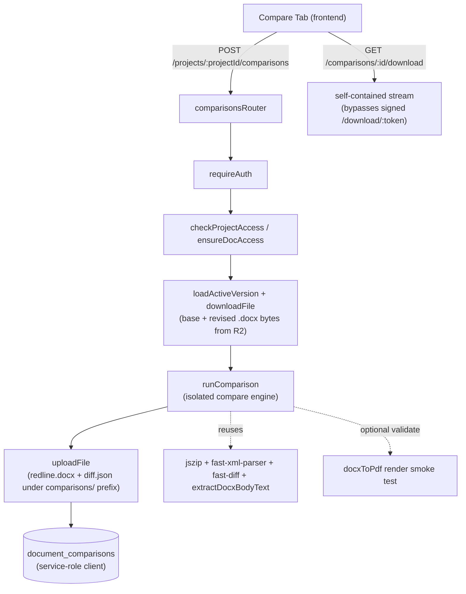

# Document Compare

Mike's Document Compare produces a deterministic redline between two `.docx`
versions of a contract — a base and a revised — and yields two artifacts: a
Microsoft Word `.docx` carrying native tracked changes (`<w:ins>` / `<w:del>`)
and a structured diff JSON of ordered hunks that powers the in-app inline and
side-by-side redline views. The diff path contains no AI and is deterministic:
identical inputs always produce identical output. This document is the
engineering reference for the compare engine, its data structures, and its API;
see the [README](../README.md) for setup, environment, and high-level usage.

## Related Docs

- [README](../README.md) — setup, environment, install/run, and high-level
  usage of the Compare tab.
- [Decision log](./decisions/document-compare-decision-log.md) — rationale,
  alternatives, risks, and the bidirectional traceability matrix. It is the
  single source of truth for *why* each decision was made; this document
  deliberately links to it rather than restating the reasoning.
- [Executive summary](./presentations/document-compare-executive-summary.html) —
  the self-contained deck for non-technical leadership.
- [Safe local testing](./safe-local-testing.md) — testing Compare with
  synthetic documents and disposable infrastructure.

## Architecture at a Glance

Document Compare is an isolated backend engine under `backend/src/compare/`,
fronted by a dedicated Express router `backend/src/routes/comparisons.ts`, a
persistence helper `backend/src/lib/documentComparisons.ts`, and a single new
table `document_comparisons`. The user-facing surface is a new **Compare** tab
inside a project. The feature reuses existing infrastructure — the Supabase
service-role client, R2/S3 object storage, the `requireAuth` middleware, and the
LibreOffice convert utility — and adds exactly **one** new dependency:
`vitest`, a backend dev-dependency scoped to the engine's tests.



The compare logic is **strictly isolated**: it lives only in
`backend/src/compare/` and `frontend/src/app/components/compare/` and is not
embedded in the assistant/chat, document-processing, tabular-review, or workflow
code paths. Edits to existing files are confined to registration (mounting the
router and its rate limiters in `backend/src/index.ts`), type extensions, and
UI tab plumbing, each accompanied by a clear comment.

## Engine Pipeline

The orchestrator is `runComparison(baseBytes, revisedBytes, opts)` in
`backend/src/compare/index.ts`. It returns `{ redlineBytes, diff }`, where `diff`
is a `DiffJson`. The `opts` object is `{ author, date }`, and **`opts.date` is
the single source of time** threaded through the whole engine — this is what
makes the output reproducible (see [Determinism](#determinism)).

```ts
// backend/src/compare/index.ts
interface CompareOptions {
  author: string; // written into every tracked change's w:author
  date: string;   // ISO-8601 timestamp; the single source of time for the engine
}

// baseBytes / revisedBytes are the raw .docx file contents (Node Buffer / Uint8Array).
async function runComparison(
  baseBytes: Uint8Array,
  revisedBytes: Uint8Array,
  opts: CompareOptions,
): Promise<{ redlineBytes: Uint8Array; diff: DiffJson }>;
```

The pipeline runs in this fixed order:

1. **Parse** (`parseDocx.ts`) — unzip each `.docx` with `jszip`, parse
   `word/document.xml` with `fast-xml-parser` in `preserveOrder` mode, and
   extract an ordered list of paragraphs and their runs while preserving each
   run's `<w:rPr>` (run properties / formatting).
2. **Normalize** (`normalize.ts`) — accept-all normalization: for any input
   already carrying tracked changes, unwrap `<w:ins>` content (keep it) and drop
   `<w:del>` content, producing clean "accepted-view" text so the diff runs
   against final text. This is reimplemented locally and does **not** import
   `docxTrackedChanges.ts` internals.
3. **Align paragraphs** (`alignParagraphs.ts`) — deterministic LCS alignment
   over normalized paragraph hashes/text (hashes via `node:crypto`), with a
   fixed tie-break (favor deletion) so the result is stable. Unmatched base
   paragraphs become deletions; unmatched revised paragraphs become insertions;
   matched pairs emit `equal` / `del` / `ins` operations.
4. **Word-level diff** (`wordDiff.ts`) — within matched paragraphs, run
   `fast-diff` to produce typed segments. The **reconstruction invariant** holds:
   `equal` + `del` segments reconstruct the base text; `equal` + `ins` segments
   reconstruct the revised text.
5. **Emit tracked changes** (`emitTrackedChanges.ts`) — build the merged
   `word/document.xml` with native tracked changes and rezip a valid `.docx`
   (covered in [OOXML Tracked-Changes Model](#ooxml-tracked-changes-model)).
6. **Build diff JSON** (`diffJson.ts`) — `buildDiffJson(...)` serializes the
   ordered hunks consumed by the UI.
7. **Validate** (`validate.ts`) — reparse the emitted `.docx` (FATAL on failure)
   and optionally call `docxToPdf(redline)` as a SOFT render smoke test (skipped
   if LibreOffice / `soffice` is not installed).

## Module Map

Each file under `backend/src/compare/` has a single responsibility:

| File | Responsibility |
|------|----------------|
| `index.ts` | Orchestrator `runComparison`; wires the pipeline; `opts.date` is the sole time source. |
| `parseDocx.ts` | `jszip` + `fast-xml-parser` (`preserveOrder`); ordered paragraphs/runs preserving `<w:rPr>`. Owns the shared read-side OOXML helpers; reuses only the public `extractDocxBodyText` from `../lib/docxTrackedChanges`. |
| `normalize.ts` | Accept-all normalization (unwrap `<w:ins>`, drop `<w:del>`). |
| `alignParagraphs.ts` | Deterministic LCS paragraph alignment; `node:crypto` hashing; fixed tie-break. |
| `wordDiff.ts` | `fast-diff` word-level diff within matched paragraphs. |
| `emitTrackedChanges.ts` | Emits native `<w:ins>` / `<w:del>`; deterministic rezip. |
| `diffJson.ts` | Diff-JSON contract types + `buildDiffJson`. |
| `validate.ts` | Reparse + optional `docxToPdf` render check. |
| `storageKeys.ts` | Pure R2 key helpers (no I/O). |
| `__tests__/` | Vitest unit + integration tests and `.docx` golden fixtures. |

## OOXML Tracked-Changes Model

The redline is emitted as native Word tracked changes inside
`word/document.xml`. Inserted content is wrapped in `<w:ins>`:

```xml
<w:ins w:id="1" w:author="Jane Doe" w:date="2026-06-16T12:00:00Z">
  <w:r>
    <w:rPr><!-- carried source run properties --></w:rPr>
    <w:t xml:space="preserve">inserted text</w:t>
  </w:r>
</w:ins>
```

Deleted content is wrapped in `<w:del>`, and inside a deleted run the text
element `<w:t>` is replaced by `<w:delText>`:

```xml
<w:del w:id="2" w:author="Jane Doe" w:date="2026-06-16T12:00:00Z">
  <w:r>
    <w:rPr><!-- carried source run properties --></w:rPr>
    <w:delText xml:space="preserve">deleted text</w:delText>
  </w:r>
</w:del>
```

A **deleted paragraph mark** is represented by placing a `<w:del .../>` inside
the paragraph's `<w:pPr><w:rPr>`:

```xml
<w:pPr>
  <w:rPr>
    <w:del w:id="3" w:author="Jane Doe" w:date="2026-06-16T12:00:00Z"/>
  </w:rPr>
</w:pPr>
```

Emission rules:

- Each change carries a **monotonic, unique** `w:id`.
- Source run formatting `<w:rPr>` is carried onto emitted runs so formatting is
  preserved.
- The `w:` namespace (`xmlns:w`) is preserved on the document root.

### Compatibility

The redline must open cleanly in both Microsoft Word and Google Docs. The
compatibility levers are unique `w:id` values, valid `w:author` / `w:date`,
carried `<w:rPr>`, and validation by reparse plus an optional LibreOffice render.

### Out of Scope (V1)

Formatting-only tracking (`<w:rPrChange>` / `<w:pPrChange>`) and moves
(`moveFrom` / `moveTo`) are **not** emitted in V1. A move renders as a deletion
plus an insertion.

## Diff JSON Contract

The structured diff is the second artifact and drives both frontend renderers.
The shapes below mirror `backend/src/compare/diffJson.ts` and are re-declared in
`frontend/src/app/components/shared/types.ts`:

```ts
type DiffHunkType = "ins" | "del" | "equal";

interface DiffRange {
  start: number; // inclusive character offset (UTF-16 code units)
  end: number;   // exclusive character offset (UTF-16 code units)
}

interface DiffHunk {
  type: DiffHunkType;
  text: string;
  baseRange: DiffRange | null;    // null for pure insertions (type "ins")
  revisedRange: DiffRange | null; // null for pure deletions (type "del")
}

interface DiffJson {
  hunks: DiffHunk[];
}
```

The contract is `{ hunks: DiffHunk[] }` — in V1 there is no additional top-level
metadata, and any future top-level fields would be additive and optional.
Semantics:

- Hunks are **ordered** (document order); a consumer reconstructs both columns
  in a single walk of the array.
- `baseRange` indexes into the base plaintext; `revisedRange` indexes into the
  revised plaintext. Both are half-open `[start, end)` ranges in UTF-16 code
  units.
- `equal` hunks appear in both columns (both ranges non-null); `del` hunks appear
  only in the base column (`revisedRange` is `null`); `ins` hunks appear only in
  the revised column (`baseRange` is `null`).

The frontend `SideBySideDiff` builds the base column from `equal` + `del` hunks
and the revised column from `equal` + `ins` hunks. On the backend, `buildDiffJson`
converts an ordered list of typed text segments into this hunk list in a single
deterministic left-to-right pass, assigning per-column offsets as it goes and
skipping zero-length segments.

## Data Model

The feature adds a single new table, `document_comparisons`; no existing table
is altered. The column summary (a documentation view, not the migration itself):

```sql
-- Documentation summary of document_comparisons (see the migration for the
-- authoritative DDL, indexes, RLS, and grant revocation).
create table public.document_comparisons (
  id                   uuid primary key default gen_random_uuid(),
  project_id           uuid not null references public.projects(id)  on delete cascade,
  base_document_id     uuid not null references public.documents(id) on delete cascade,
  revised_document_id  uuid not null references public.documents(id) on delete cascade,
  created_by           text,
  status               text not null default 'pending'
                         check (status in ('pending', 'processing', 'complete', 'error')),
  redline_storage_path text,          -- R2 key of the redline .docx
  diff_storage_path    text,          -- R2 key of the diff JSON
  error                text,          -- error message when status = 'error'
  created_at           timestamptz not null default now(),
  updated_at           timestamptz not null default now()
);
```

- The table ships as exactly **one** dated, idempotent migration
  `backend/migrations/20260616_01_document_comparisons.sql`. It uses
  `create table if not exists`, adds `create index if not exists` indexes on
  `project_id` and on `created_by`, runs `enable row level security`, and issues
  `revoke all privileges ... from anon, authenticated`. A matching block is
  appended to `backend/schema.sql` for fresh databases.
- `created_by` is a nullable `text` column (deliberately named `created_by`,
  consistent with the column the feature references).

### Access Model

- Access is enforced at the **application layer**: grants are revoked from the
  `anon` and `authenticated` roles, and every route calls `checkProjectAccess`
  (the service-role client bypasses RLS). RLS is enabled as defense-in-depth.
  This matches the existing project-scoped tables — there are no per-row
  `create policy` statements.
- Access denials are masked as **`404`** (never `403`), so a caller cannot probe
  for the existence of another project's comparisons.
- For the full rationale, see the
  [decision log](./decisions/document-compare-decision-log.md).

## API Contract

All three endpoints mount behind `requireAuth`, follow the repository's
**no-`/api`-prefix** router convention, and enforce project access. Access
denials are masked as `404`.

### `POST /projects/:projectId/comparisons`

Create and run a comparison. Request body:

```json
{
  "baseDocumentId": "0f1e2d3c-4b5a-6978-8796-a5b4c3d2e1f0",
  "revisedDocumentId": "9e8d7c6b-5a49-3827-1605-f4e3d2c1b0a9"
}
```

Behavior:

1. Validates the body with `zod`.
2. Runs `checkProjectAccess`, then `ensureDocAccess` on both the base and revised
   documents.
3. Resolves input bytes via `loadActiveVersion` + `downloadFile`.
4. **Rejects non-`.docx` inputs with `400`** — no conversion is attempted.
5. Inserts a `processing` row.
6. Runs `runComparison` **synchronously** (there is no job queue in V1).
7. Uploads the redline (`.docx`) and the diff (`application/json`) under the
   `comparisons/` prefix.
8. Updates the row to `complete` and returns **`201`** with the comparison record
   and the diff.

On failure, the row is set to `error` and the endpoint returns `500`. A
successful `201` response:

```json
{
  "id": "b6f1e2a0-9c3d-4e8a-b1f2-3c4d5e6f7a8b",
  "project_id": "1a2b3c4d-5e6f-7a8b-9c0d-1e2f3a4b5c6d",
  "base_document_id": "0f1e2d3c-4b5a-6978-8796-a5b4c3d2e1f0",
  "revised_document_id": "9e8d7c6b-5a49-3827-1605-f4e3d2c1b0a9",
  "created_by": "user_2abcXYZ",
  "status": "complete",
  "redline_storage_path": "comparisons/user_2abcXYZ/b6f1e2a0-9c3d-4e8a-b1f2-3c4d5e6f7a8b/redline.docx",
  "diff_storage_path": "comparisons/user_2abcXYZ/b6f1e2a0-9c3d-4e8a-b1f2-3c4d5e6f7a8b/diff.json",
  "error": null,
  "created_at": "2026-06-16T12:00:00.000Z",
  "updated_at": "2026-06-16T12:00:03.500Z",
  "diff": {
    "hunks": [
      { "type": "equal", "text": "This Agreement is made as of ", "baseRange": { "start": 0, "end": 29 }, "revisedRange": { "start": 0, "end": 29 } },
      { "type": "del", "text": "2025", "baseRange": { "start": 29, "end": 33 }, "revisedRange": null },
      { "type": "ins", "text": "2026", "baseRange": null, "revisedRange": { "start": 29, "end": 33 } }
    ]
  }
}
```

### `GET /comparisons/:id`

Status/result polling. Returns the row in snake_case. While the comparison is
running:

```json
{
  "id": "b6f1e2a0-9c3d-4e8a-b1f2-3c4d5e6f7a8b",
  "project_id": "1a2b3c4d-5e6f-7a8b-9c0d-1e2f3a4b5c6d",
  "base_document_id": "0f1e2d3c-4b5a-6978-8796-a5b4c3d2e1f0",
  "revised_document_id": "9e8d7c6b-5a49-3827-1605-f4e3d2c1b0a9",
  "created_by": "user_2abcXYZ",
  "status": "processing",
  "redline_storage_path": null,
  "diff_storage_path": null,
  "error": null,
  "created_at": "2026-06-16T12:00:00.000Z",
  "updated_at": "2026-06-16T12:00:00.000Z"
}
```

When `status` is `complete`, the response additionally includes the parsed diff
JSON under `diff`:

```json
{
  "id": "b6f1e2a0-9c3d-4e8a-b1f2-3c4d5e6f7a8b",
  "project_id": "1a2b3c4d-5e6f-7a8b-9c0d-1e2f3a4b5c6d",
  "base_document_id": "0f1e2d3c-4b5a-6978-8796-a5b4c3d2e1f0",
  "revised_document_id": "9e8d7c6b-5a49-3827-1605-f4e3d2c1b0a9",
  "created_by": "user_2abcXYZ",
  "status": "complete",
  "redline_storage_path": "comparisons/user_2abcXYZ/b6f1e2a0-9c3d-4e8a-b1f2-3c4d5e6f7a8b/redline.docx",
  "diff_storage_path": "comparisons/user_2abcXYZ/b6f1e2a0-9c3d-4e8a-b1f2-3c4d5e6f7a8b/diff.json",
  "error": null,
  "created_at": "2026-06-16T12:00:00.000Z",
  "updated_at": "2026-06-16T12:00:03.500Z",
  "diff": { "hunks": [] }
}
```

### `GET /comparisons/:id/download`

A **self-contained, access-checked streaming** handler. It performs its own
`checkProjectAccess` and streams the redline `.docx` directly, with a
`Content-Disposition: attachment` header and the filename
`comparison-redline.docx`. It deliberately **does not** route through the signed
`/download/:token` mechanism, because that route resolves only
`document_versions` rows and a `comparisons/`-prefixed key would `404` there.
`backend/src/routes/downloads.ts` is left untouched. See the
[decision log](./decisions/document-compare-decision-log.md) for the rationale.

### Rate Limiting

`backend/src/index.ts` declares a `compareLimiter` (a small hourly cap on the
create endpoint) and a `downloadLimiter` (a per-minute cap on the download
endpoint), alongside the existing per-route limiters.

## Storage Layout

The redline `.docx` and the diff JSON are written to R2 under a new prefix,
produced by `backend/src/compare/storageKeys.ts`:

```text
comparisons/{userId}/{comparisonId}/redline.docx
comparisons/{userId}/{comparisonId}/diff.json
```

This is a **new** key prefix that does not change existing R2 conventions. The
two keys are persisted on the row as `redline_storage_path` and
`diff_storage_path`.

## Determinism

Determinism is a headline property of the engine and is what the golden-file
tests pin:

- There is **no AI anywhere in the diff path**. Alignment is LCS with a fixed
  tie-break; word-level diff is `fast-diff`. Neither introduces nondeterminism.
- `opts.date` is the single source of time, threaded into every `w:date`
  attribute. The engine never calls `Date.now()` and uses no randomness.
- The rezip step normalizes every zip entry's date to `opts.date` and uses a
  fixed DEFLATE compression level, so identical inputs (with the same `opts`)
  yield a **byte-identical** redline `.docx`.

Honest caveat (a logged deviation): in the live route the `date` and `author`
come from the request time and the signed-in user, so two runs of the *same*
documents at *different* times will differ in the `w:date` attribute. The
guarantee is precise: **identical inputs (including `opts`) produce identical
output** — which is exactly what the golden-file tests fix by supplying a fixed
`opts.date`. See the
[decision log](./decisions/document-compare-decision-log.md) for the recorded
deviation.

## Frontend Overview

The Compare UI is a single page rendered inside the existing project workspace
shell (deep UI rationale lives in the
[decision log](./decisions/document-compare-decision-log.md); this doc keeps the
frontend summary short because the feature is backend-leaning):

- `frontend/src/app/(pages)/projects/[id]/compare/page.tsx` — the route page;
  renders the workspace shell toolbar plus `CompareView`.
- `frontend/src/app/components/compare/CompareView.tsx` — two document pickers
  (built on the shadcn `DropdownMenu`, filtered to `status === "ready"` and
  `file_type === "docx"`), a Run button that calls `createComparison`, a status
  `Badge`, roughly one-second polling of `getComparison`, a result panel that
  toggles **Inline redline** vs **Side-by-side**, and a Download button.
- `frontend/src/app/components/compare/RedlineDocxView.tsx` — the inline redline,
  rendered with `docx-preview` (`renderChanges: true`), where `<w:ins>` /
  `<w:del>` appear as `<ins>` / `<del>`.
- `frontend/src/app/components/compare/SideBySideDiff.tsx` — two columns driven
  by the diff JSON hunks, with next/previous change navigation.

The tab is wired in with minimal, commented edits to
`frontend/src/app/components/projects/ProjectPageParts.tsx` (the
`ProjectWorkspaceSection` union), `frontend/src/app/components/projects/ProjectWorkspace.tsx`
(the tab item, its `onChange` route branch, and the URL-segment helpers),
`frontend/src/app/lib/mikeApi.ts` (the compare client functions), and
`frontend/src/app/components/shared/types.ts` (the comparison interfaces).

## Testing

- Tests live in `backend/src/compare/__tests__/` and run via Vitest, scoped by
  `backend/vitest.config.ts` to `src/compare/**/*.test.ts`.
- Run them with the scoped script:

```bash
npm run test:compare --prefix backend
```

  This runs `vitest run` — non-watch and CI-safe.

- Golden-file `.docx` fixtures cover: word insert, word delete, mixed edit, added
  paragraph, deleted paragraph, identical documents, and inputs already carrying
  tracked changes.
- The tests are isolated and do not wire into any unrelated suite. `vitest` is
  the only new dependency introduced by the whole feature.

## Out of Scope (V1) & Extending the Engine

The following are intentionally out of scope in V1:

- Move detection (a move is rendered as a deletion plus an insertion).
- Formatting-only change tracking (`<w:rPrChange>` / `<w:pPrChange>`).
- Comments, footnotes, endnotes, images, and other embedded objects.
- Header/footer diffing.
- Legacy `.doc` and PDF-native compare (rejected with a clear error, not
  converted, in V1).
- 3-way merge.
- Any AI-suggested-redline / playbook layer.

Extension pointers (the exhaustive "next tasks" list lives in the
[README](../README.md); the reasoning behind each V1 boundary lives in the
[decision log](./decisions/document-compare-decision-log.md)):

- **Move detection** would extend `alignParagraphs.ts` to recognize
  matched-but-relocated paragraphs and `emitTrackedChanges.ts` to emit
  `moveFrom` / `moveTo` instead of a delete/insert pair.
- **Formatting-only change tracking** would hook into `emitTrackedChanges.ts`,
  emitting `<w:rPrChange>` / `<w:pPrChange>` when only run/paragraph properties
  differ between matched content.
- **An async worker** could later consume the existing `status` column: the
  create endpoint would insert a `pending` row and return immediately, and a
  worker would move the row through `processing` to `complete`/`error`. The
  `status` enum and the `GET /comparisons/:id` polling endpoint already keep the
  contract async-ready, so no API shape would change.
